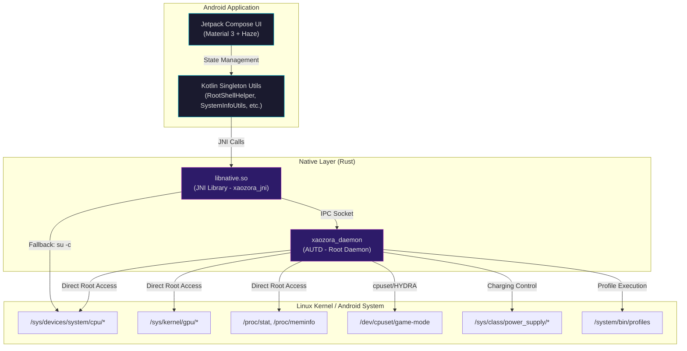

<p align="center">
  
</p>

<h1 align="center">Aozora Kernel Manager</h1>

<p align="center">
  <strong>Native Android kernel manager and system tuner with a Rust-powered daemon</strong>
</p>

<p align="center">
  <a href="https://github.com/xMikkkaa/Aozora-Kernel-Manager/releases/latest"></a>
  <a href="https://github.com/xMikkkaa/Aozora-Kernel-Manager/actions"></a>
  
  
  <a href="LICENSE"></a>
  
</p>

---

Aozora Kernel Manager is a native Android application built with **Kotlin** and **Jetpack Compose (Material 3)** for managing kernel parameters, performance profiles, and system tuning. It features a high-performance **Rust-based native daemon (AUTD)** that provides automated per-app performance profiling, real-time hardware monitoring, kernel-level thread optimization, and low-latency root command execution through Unix Domain Socket IPC — all presented through a glassmorphic Material 3 UI with Monet dynamic theming.

## Features

### 🖥️ Real-Time Hardware Monitoring
- **CPU**: Total load percentage with animated gauge + per-core frequency readout (8 cores)
- **GPU**: Live GPU load percentage and current frequency (Adreno)
- **Memory**: RAM and ZRAM usage with animated progress bars
- **Battery**: Real-time current draw (mA), wattage (W), temperature (°C/°F), and charge status

### ⚡ Hardware Tuning
- **CPU Cluster Control**: Independent min/max frequency and governor settings for LITTLE (0-3) and BIG (4-7) clusters
- **GPU Control**: Min/max frequency, governor, and Adreno Boost level tuning
- **Profile Scripts**: Built-in shell script viewer/editor for advanced kernel profile customization (Developer Mode)

### 🎮 Performance Profiles
| Profile | Description |
|---|---|
| Powersave | Aggressive battery saving with reduced clock speeds |
| Balance | Daily driver — balanced power and performance |
| Gaming | High-performance tuning for gaming workloads |
| Gaming 2 | Secondary game tuning preset |
| Performance | Sustained peak clocking for maximum throughput |
| Cache Cleaner | Instant system cache eviction |

### 🤖 Automated Per-App Tuning
- Assign performance, gaming, or gaming 2 profiles to individual apps
- Automatic profile switching when a registered app enters the foreground
- Background game process detection via PID monitoring and cgroup analysis
- Toast notifications on automatic profile switches

### 🔧 Kernel Tweaks
- **RAM Flush**: Kills high-OOM background apps, drops caches, compacts memory, force-stops third-party apps, and runs `fstrim`
- **Game Thread Optimization**: Dedicates big/prime cores to game processes via `/dev/cpuset/game-mode`
- **HYDRA Kernel Affinity**: Zero-latency kernel-space thread scheduling for supported kernels (`/proc/sys/kernel/hydra_pid`)
- **Sched Library Optimization**: Forces kernel scheduler awareness for game engine libraries (Unity, Unreal, Godot, Cocos2d, etc.)

### 🔋 Bypass Charging
- Automatic bypass during gaming to reduce thermal throttling
- Manual toggle for idle charging
- Multi-kernel support: Aozora (`input_suspend`), Chimera (`bypass_charging`), and fallback (`constant_charge_current_max`)

### 📊 Battery Analytics (Battmon)
- **Screen-On Stats**: Total screen time, mAh consumed, active drain rate (%/hr)
- **Screen-Off / Sleep Stats**: Idle drain rate, deep sleep duration and percentage, awake-while-off duration
- **Historical Stats**: Total discharge, doze modes, wakelock duration, connectivity changes
- **Configurable Alerts**: High idle drain threshold (0.5% - 10.0%/hr)
- **Auto-Reset Rules**: Reset on battery percentage threshold, charger connect, or reboot
- **Status Bar Integration**: Persistent notification with live wattage, temperature, and drain rates

### 📱 Quick Settings Tile
- Android Quick Settings tile for instant profile switching
- Shows active profile in real-time without opening the app

### 🔄 In-App Updates
- Automatic GitHub release version checking
- One-tap APK download and silent root installation

### 🎨 UI / UX
- Glassmorphic design powered by [Haze](https://github.com/chrisbanes/haze) blur effects
- Material 3 with Monet dynamic color theming (Auto/Light/Dark)
- Custom home banner with adjustable vertical alignment
- Horizontal swipe navigation with floating glass bottom bar

## Architecture



**Key architectural decisions:**
- **No ViewModels** — UI state is managed directly with Compose `remember` / `mutableStateOf` and `LaunchedEffect`
- **IPC-first root execution** — Commands are routed through a Unix Domain Socket to the persistent daemon, avoiding per-command `su` process spawning overhead
- **Dual Rust binaries** — JNI library handles hardware queries and IPC client logic; standalone daemon handles background automation, game detection, and kernel tuning

## Tech Stack

| Component | Technology |
|---|---|
| **Language** | Kotlin 2.3, Rust (edition 2021/2024) |
| **UI Framework** | Jetpack Compose + Material 3 + Haze 1.7 |
| **Build System** | Gradle 9.4, AGP 9.2, cargo-ndk |
| **Compose BOM** | 2026.04.01 |
| **Navigation** | HorizontalPager-based swipe navigation |
| **Background Work** | WorkManager 2.11, Foreground Service (specialUse) |
| **Serialization** | Gson 2.10 (Kotlin), serde/serde_json (Rust) |
| **HTTP Client** | ureq 2.9 (Rust-side, for update checks) |
| **Native Integration** | JNI via Rust (`jni = 0.21`), Unix Domain Socket IPC |
| **Target ABI** | `arm64-v8a` only |
| **Java Compatibility** | JDK 17 |

## Requirements

- Android **10+** (API 29) device with **arm64-v8a** architecture
- **Root access** via [Magisk](https://github.com/topjohnwu/Magisk), [KernelSU](https://github.com/tiann/KernelSU), or [APatch](https://github.com/bmax121/APatch)
- [**Aozora Kernel Helper**](https://t.me/KaiProject2/1077) module installed (provides profile binaries and modified Powerhal in `/system/bin/`)

> [!NOTE]
> The App Manager and automated background services require the built-in **xaozora_daemon (AUTD)** to be running. Without it, the app operates in basic mode (manual profile switching only). The daemon is bundled with the APK and starts automatically.

## Installation

### Download
Get the latest APK from [**GitHub Releases**](https://github.com/xMikkkaa/Aozora-Kernel-Manager/releases/latest).

### Install
```bash
# Via ADB
adb install app-release.apk

# Or via root shell
pm install -r app-release.apk
```

Grant root access when prompted on first launch.

## Building from Source

### Prerequisites

| Tool | Version | Purpose |
|---|---|---|
| Android Studio | Latest stable | IDE and Android SDK |
| JDK | 17+ | Java compilation |
| Rust | Latest stable | Native components |
| `cargo-ndk` | Latest | Cross-compilation for Android |
| Android NDK | `27.0.12077973` | Native toolchain |

### Setup Rust Toolchain

```bash
# Install Rust (if not already installed)
curl --proto '=https' --tlsv1.2 -sSf https://sh.rustup.rs | sh

# Add Android target
rustup target add aarch64-linux-android

# Install cargo-ndk
cargo install cargo-ndk

# Ensure Android NDK is installed via Android Studio SDK Manager
# or set ANDROID_NDK_HOME environment variable
```

### Build

```bash
# Clone the repository
git clone https://github.com/xMikkkaa/Aozora-Kernel-Manager.git
cd Aozora-Kernel-Manager

# Build Rust JNI library (libnative.so)
cd app/src/main/rust/xaozora_jni
cargo ndk -t arm64-v8a -o ../../libs build --release

# Build Rust daemon (xaozora_daemon)
cd ../xaozora_daemon
cargo ndk -t arm64-v8a build --release

# Return to project root
cd ../../../../..

# Build APK (debug)
./gradlew assembleDebug

# Build APK (release — requires signing config in key.properties)
./gradlew assembleRelease
```

> [!TIP]
> The Gradle build automatically triggers `buildRustJni`, `buildRustDaemon`, and `copyRustDaemonToAssets` tasks. Running `./gradlew assembleRelease` will compile everything if `cargo-ndk` and the Rust toolchain are properly configured.

## Project Structure

```
├── app/src/main/
│   ├── kotlin/com/xaozora/manager/
│   │   ├── MainActivity.kt              # App entrypoint, root init, daemon startup
│   │   ├── core/
│   │   │   ├── models/                   # Data classes (BatteryStats, etc.)
│   │   │   ├── network/                  # UpdateManager (JNI → GitHub API)
│   │   │   ├── shell/                    # RootShellHelper (JNI declarations)
│   │   │   └── utils/                    # CpuControl, GpuControl, SystemInfo,
│   │   │                                 # AppManager, NativeDaemonManager
│   │   ├── services/
│   │   │   ├── MonitorService.kt         # Foreground service (battery, screen, daemon)
│   │   │   ├── ProfileTileService.kt     # Quick Settings tile
│   │   │   ├── BootReceiver.kt           # BOOT_COMPLETED handler
│   │   │   ├── BootWorker.kt             # WorkManager boot task
│   │   │   └── ToastReceiver.kt          # Daemon → UI toast bridge
│   │   └── ui/
│   │       ├── components/               # GlassCard, dialogs, bottom nav, splash
│   │       ├── navigation/               # HorizontalPager NavGraph
│   │       ├── screens/                  # Home, Tuning, Tweaks, AppManager,
│   │       │                             # Battery, Settings, About
│   │       └── theme/                    # Material 3 theme, colors, typography
│   ├── rust/
│   │   ├── xaozora_jni/                  # Rust JNI library source
│   │   │   └── src/                      # shell.rs, cpu.rs, gpu.rs, system_info.rs,
│   │   │                                 # app_manager.rs, update_manager.rs, services.rs
│   │   └── xaozora_daemon/              # Rust daemon source
│   │       └── src/                      # main.rs, autd.rs, ipc.rs, display.rs,
│   │                                     # game_det.rs, thread_opt.rs, battery.rs, logger.rs
│   ├── libs/arm64-v8a/                   # Compiled libnative.so
│   └── assets/                           # Compiled xaozora_daemon binary
├── .github/workflows/                    # CI/CD auto-release pipeline
├── gradle/libs.versions.toml             # Centralized dependency versions
└── build.gradle.kts                      # Root build configuration
```

## Permissions

| Permission | Justification |
|---|---|
| `INTERNET` | GitHub API calls for update checks and APK downloads |
| `QUERY_ALL_PACKAGES` | Enumerating installed apps for per-app profile assignment |
| `RECEIVE_BOOT_COMPLETED` | Restoring daemon and monitoring service after device reboot |
| `POST_NOTIFICATIONS` | Foreground service notifications and battery drain alerts (API 33+) |
| `FOREGROUND_SERVICE` | Running persistent monitoring service |
| `FOREGROUND_SERVICE_SPECIAL_USE` | Required on API 34+ for system monitoring foreground services |

> [!NOTE]
> **Root access** is required but is not an Android permission — it is granted by the root manager (Magisk/KernelSU/APatch) at runtime.

## CI/CD

The project uses a **GitHub Actions** workflow ([`auto_release.yml`](.github/workflows/auto_release.yml)) for automated releases:

1. **Trigger**: Push to `kotlin` branch (filtered to workflow, build config, or APK changes) or manual dispatch
2. **Version Extraction**: Parses `versionName` from `app/build.gradle.kts`
3. **Tag Check**: Skips release if version tag already exists
4. **Changelog**: Auto-generated from git log since last tag
5. **Release**: Creates GitHub Release with the signed APK artifact

## Credits

| Role | Name |
|---|---|
| **Kernel Developer** | [Kaiyaa77](https://github.com/Kaiyaa77) |
| **Lead Developer** | [xMikkkaa](https://github.com/xMikkkaa) |
| **Lead Tester** | [Aris](https://github.com/risuue) |
| **Tester** | [Dutta](https://github.com/DuttaWry) |

## License

```
Copyright 2026 Aozora Team

Licensed under the Apache License, Version 2.0 (the "License");
you may not use this file except in compliance with the License.
You may obtain a copy of the License at

    http://www.apache.org/licenses/LICENSE-2.0

Unless required by applicable law or agreed to in writing, software
distributed under the License is distributed on an "AS IS" BASIS,
WITHOUT WARRANTIES OR CONDITIONS OF ANY KIND, either express or implied.
See the License for the specific language governing permissions and
limitations under the License.
```

## Disclaimer

> [!CAUTION]
> This application modifies kernel parameters, CPU/GPU frequencies, and system files with root access. The developers are **not responsible** for bricked devices, dead SD cards, thermonuclear war, or any other damage. **Use at your own risk.** Always ensure you have a working recovery and backup before making system-level changes.

## Links

- 📱 **Telegram**: [KaiProject2](https://t.me/KaiProject2/1077)
- 🐙 **GitHub**: [xMikkkaa/Aozora-Kernel-Manager](https://github.com/xMikkkaa/Aozora-Kernel-Manager)
- 🤖 **Automation Daemon Legacy**: [xMikkkaa/Automation-Daemon](https://github.com/xMikkkaa/Automation-Daemon)
