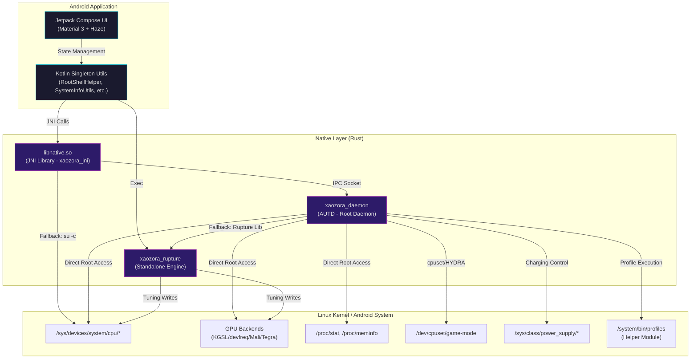

<p align="center">
  
</p>

<h1 align="center">Aozora Kernel Manager</h1>

<p align="center">
  <strong>Native Android kernel manager and system tuner with a Rust-powered daemon</strong>
</p>

<p align="center">
  <a href="https://github.com/xMikkkaa/Aozora-Kernel-Manager/releases/latest"></a>
  <a href="https://github.com/xMikkkaa/Aozora-Kernel-Manager/actions"></a>
  
  
  <a href="LICENSE"></a>
  
</p>

---

Aozora Kernel Manager is a native Android application built with **Kotlin** and **Jetpack Compose (Material 3)** for managing kernel parameters, performance profiles, and system tuning. It features a high-performance **Rust-based native daemon (AUTD)** that provides automated per-app performance profiling, real-time hardware monitoring, kernel-level thread optimization, and low-latency root command execution through Unix Domain Socket IPC — all presented through a glassmorphic Material 3 UI with Monet dynamic theming. Performance profiles run from an installed kernel-helper module when present, or from the app's bundled **Aozora-Rupture** standalone tuning engine; GPU and CPU detection is universal across SoC families.

## Features

### 🖥️ Real-Time Hardware Monitoring
- **CPU**: Total load percentage with animated gauge + per-core frequency readout (8 cores)
- **GPU**: Live GPU load and current frequency across Adreno, Mali, Tegra, and generic devfreq backends
- **Memory**: RAM and ZRAM usage with animated progress bars
- **Battery**: Real-time current draw (mA), wattage (W), temperature (°C/°F), and charge status

### ⚡ Hardware Tuning
- **CPU Cluster Control**: Min/max frequency and governor per cpufreq policy (`policyN`), auto-enumerated at runtime with LITTLE/MID/BIG labels
- **GPU Control**: Min/max frequency via universal backend detection (7 sysfs paths); governor written only when the backend exposes it; Adreno Boost on KGSL devices
- **Profile Scripts**: Built-in shell script viewer/editor for kernel-helper modules (Developer Mode); without a helper module, profiles run from the bundled standalone engine instead

### 🎮 Performance Profiles
| Profile | Description |
|---|---|
| Powersave | Aggressive battery saving with reduced clock speeds |
| Balance | Daily driver — balanced power and performance |
| Gaming | Casual gaming with schedutil and a softened GPU ceiling |
| Gaming 2 | Heavy gaming that stays cool — max clocks on schedutil |
| Performance | Full power regardless of thermal headroom |
| Cache Cleaner | Instant system cache eviction |

> Profiles execute from the helper module (`/system/bin/`) when installed, otherwise from the bundled Aozora-Rupture binaries in app storage.

### 🤖 Automated Per-App Tuning
- Assign performance, gaming, or gaming 2 profiles to individual apps
- Automatic profile switching when a registered app enters the foreground
- Background game process detection via PID monitoring and cgroup analysis
- Profile apply branches to the helper binary when present, otherwise the built-in tuning engine
- Toast notifications on automatic profile switches

### 🔧 Kernel Tweaks
- **RAM Flush**: Kills high-OOM background apps, drops caches, compacts memory, force-stops third-party apps, and runs `fstrim`
- **Game Thread Optimization**: Dedicates big/prime cores to game processes via `/dev/cpuset/game-mode`
- **HYDRA Kernel Affinity**: Zero-latency kernel-space thread scheduling for supported kernels (`/proc/sys/kernel/hydra_pid` — separate from the Aozora-Rupture tuning engine)
- **Sched Library Optimization**: Forces kernel scheduler awareness for game engine libraries (Unity, Unreal, Godot, Cocos2d, etc.)

### 🔋 Bypass Charging
- Automatic bypass during gaming to reduce thermal throttling
- Manual toggle for idle charging
- Multi-kernel support: Aozora (`input_suspend`), Chimera (`bypass_charging`), and fallback (`constant_charge_current_max`)

### 📊 Battery Analytics (Battmon)
- **Screen-On Stats**: Total screen time, mAh consumed, active drain rate (%/hr)
- **Screen-Off / Sleep Stats**: Idle drain rate, deep sleep duration and percentage, awake-while-off duration
- **Historical Stats**: Total discharge, doze modes, wakelock duration, connectivity changes
- **Configurable Alerts**: High idle drain threshold (0.5% - 10.0%/hr)
- **Auto-Reset Rules**: Reset on battery percentage threshold, charger connect, or reboot
- **Status Bar Integration**: Persistent notification with live wattage, temperature, and drain rates

### 📱 Quick Settings Tile
- Android Quick Settings tile for instant profile switching
- Shows active profile in real-time without opening the app

### 🔄 In-App Updates
- Automatic GitHub release version checking
- One-tap APK download and silent root installation

### 🎨 UI / UX
- Glassmorphic design powered by [Haze](https://github.com/chrisbanes/haze) blur effects
- Material 3 with Monet dynamic color theming (Auto/Light/Dark)
- Custom home banner with adjustable vertical alignment
- Horizontal swipe navigation with floating glass bottom bar

## Architecture


```mermaid
graph TD
    subgraph "Android Application"
        A["Jetpack Compose UI<br/>(Material 3 + Haze)"]
        B["Kotlin Singleton Utils<br/>(RootShellHelper, SystemInfoUtils, etc.)"]
    end

    subgraph "Native Layer (Rust)"
        C["libnative.so<br/>(JNI Library - xaozora_jni)"]
        D["xaozora_daemon<br/>(AUTD - Root Daemon)"]
        K["xaozora_rupture<br/>(Standalone Engine)"]
    end

    subgraph "Linux Kernel / Android System"
        E["/sys/devices/system/cpu/*"]
        F["GPU Backends<br/>(KGSL/devfreq/Mali/Tegra)"]
        G["/proc/stat, /proc/meminfo"]
        H["/dev/cpuset/game-mode"]
        I["/sys/class/power_supply/*"]
        J["/system/bin/profiles<br/>(Helper Module)"]
    end

    A -->|"State Management"| B
    B -->|"JNI Calls"| C
    B -->|"Exec"| K
    C -->|"IPC Socket"| D
    C -->|"Fallback: su -c"| E
    D -->|"Direct Root Access"| E
    D -->|"Direct Root Access"| F
    D -->|"Direct Root Access"| G
    D -->|"cpuset/HYDRA"| H
    D -->|"Charging Control"| I
    D -->|"Profile Execution"| J
    D -->|"Fallback: Rupture Lib"| K
    K -->|"Tuning Writes"| E
    K -->|"Tuning Writes"| F

    style A fill:#1a1a2e,stroke:#00bcd4,color:#e0e0e0
    style B fill:#1a1a2e,stroke:#00bcd4,color:#e0e0e0
    style C fill:#2d1b69,stroke:#9c27b0,color:#e0e0e0
    style D fill:#2d1b69,stroke:#9c27b0,color:#e0e0e0
    style K fill:#2d1b69,stroke:#9c27b0,color:#e0e0e0
```

**Key architectural decisions:**
- **No ViewModels** — UI state is managed directly with Compose `remember` / `mutableStateOf` and `LaunchedEffect`
- **IPC-first root execution** — Commands are routed through a Unix Domain Socket to the persistent daemon, avoiding per-command `su` process spawning overhead
- **Triple Rust crates** — JNI library handles hardware queries and IPC client logic; standalone daemon handles background automation and game detection; the rupture crate provides the tuning engine as both a standalone executable suite and a library dependency
- **Helper-first branching** — Tuning execution prefers Magisk-installed `/system/bin` modules if found, otherwise dynamically falling back to the bundled rupture engine
- **Universal hardware detection** — GPU backends and CPU policies are enumerated dynamically at runtime to support diverse SoC vendors without hardcoding paths

## Tech Stack

| Component | Technology |
|---|---|
| **Language** | Kotlin 2.4.10, Rust (edition 2021/2024) |
| **UI Framework** | Jetpack Compose + Material 3 + Haze 1.7.3 |
| **Build System** | Gradle 9.7.1, AGP 9.4.0, cargo-ndk |
| **Compose BOM** | 2026.08.00 |
| **Navigation** | HorizontalPager-based swipe navigation |
| **Background Work** | WorkManager 2.11, Foreground Service (specialUse) |
| **Serialization** | Gson 2.14.0 (Kotlin), serde/serde_json (Rust) |
| **HTTP Client** | ureq 3.4 (Rust-side, for update checks) |
| **Native Integration** | JNI via Rust (`jni = 0.22`), Unix Domain Socket IPC |
| **Tuning Engine** | `xaozora_rupture` (standalone bin suite + lib, edition 2024) |
| **Target ABI** | `arm64-v8a` only |
| **Java Compatibility** | JDK 17 |

## Requirements

- Android **10+** (API 29) device with **arm64-v8a** architecture
- **Root access** via [Magisk](https://github.com/topjohnwu/Magisk), [KernelSU](https://github.com/tiann/KernelSU), or [APatch](https://github.com/bmax121/APatch)
- *(Optional)* [**Aozora Kernel Helper**](https://t.me/KaiProject2/1077) module installed for legacy shell script profiling and developer mode script editing. Without it, the app seamlessly falls back to the bundled standalone tuning engine.

> [!NOTE]
> The App Manager and automated background services require the built-in **xaozora_daemon (AUTD)** to be running. Without it, the app operates in basic mode (manual profile switching only). The daemon is bundled with the APK and starts automatically.

## Installation

### Download
Get the latest APK from [**GitHub Releases**](https://github.com/xMikkkaa/Aozora-Kernel-Manager/releases/latest).

### Install
```bash
# Via ADB
adb install app-release.apk

# Or via root shell
pm install -r app-release.apk
```

Grant root access when prompted on first launch.

## Building from Source

### Prerequisites

| Tool | Version | Purpose |
|---|---|---|
| Android Studio | Latest stable | IDE and Android SDK |
| JDK | 17+ | Java compilation |
| Rust | Latest stable | Native components |
| `cargo-ndk` | Latest | Cross-compilation for Android |
| Android NDK | `27.0.12077973` | Native toolchain |

### Setup Rust Toolchain

```bash
# Install Rust (if not already installed)
curl --proto '=https' --tlsv1.2 -sSf https://sh.rustup.rs | sh

# Add Android target
rustup target add aarch64-linux-android

# Install cargo-ndk
cargo install cargo-ndk

# Ensure Android NDK is installed via Android Studio SDK Manager
# or set ANDROID_NDK_HOME environment variable
```

### Build

```bash
# Clone the repository
git clone https://github.com/xMikkkaa/Aozora-Kernel-Manager.git
cd Aozora-Kernel-Manager

# Build Rust JNI library (libnative.so)
cd rust/xaozora_jni
cargo ndk -t arm64-v8a -o ../../manager/app/src/main/libs build --release

# Build Rust standalone tuning engine (xaozora_rupture binaries)
cd ../xaozora_rupture
cargo ndk -t arm64-v8a build --release --bins

# Build Rust daemon (xaozora_daemon)
cd ../xaozora_daemon
cargo ndk -t arm64-v8a build --release

# Return to project root
cd ../..

# Build APK (debug)
./gradlew assembleDebug

# Build APK (release — requires signing config in key.properties)
./gradlew assembleRelease
```

> [!TIP]
> The Gradle build automatically triggers `buildRustJni`, `buildRustRupture`, `buildRustDaemon`, and copy tasks to assets. Running `./gradlew assembleRelease` will compile everything if `cargo-ndk` and the Rust toolchain are properly configured.

## Project Structure

```
├── manager/app/src/main/
│   ├── kotlin/com/xaozora/manager/
│   │   ├── MainActivity.kt              # App entrypoint, root init, daemon startup
│   │   ├── core/
│   │   │   ├── models/                   # Data classes (BatteryStats, etc.)
│   │   │   ├── network/                  # UpdateManager (JNI → GitHub API)
│   │   │   ├── shell/                    # RootShellHelper (JNI declarations)
│   │   │   └── utils/                    # CpuControl, GpuControl, SystemInfo,
│   │   │                                 # AppManager, NativeDaemonManager
│   │   ├── services/
│   │   │   ├── MonitorService.kt         # Foreground service (battery, screen, daemon)
│   │   │   ├── ProfileTileService.kt     # Quick Settings tile
│   │   │   ├── BootReceiver.kt           # BOOT_COMPLETED handler
│   │   │   ├── BootWorker.kt             # WorkManager boot task
│   │   │   └── ToastReceiver.kt          # Daemon → UI toast bridge
│   │   └── ui/
│   │       ├── components/               # GlassCard, dialogs, bottom nav, splash
│   │       ├── navigation/               # HorizontalPager NavGraph
│   │       ├── screens/                  # Home, Tuning, Tweaks, AppManager,
│   │       │                             # Battery, Settings, About
│   │       └── theme/                    # Material 3 theme, colors, typography
│   ├── libs/arm64-v8a/           # Compiled libnative.so
│   └── assets/                   # Compiled daemon and xaozora_rupture binaries
├── rust/
│   ├── xaozora_jni/              # Rust JNI library source
│   │   └── src/                  # shell.rs, cpu.rs, gpu.rs, system_info.rs,
│   │                             # app_manager.rs, update_manager.rs, services.rs
│   ├── xaozora_rupture/          # Standalone tuning engine source
│   │   ├── Cargo.toml            # [lib] + 6 [[bin]] configuration
│   │   └── src/
│   │       ├── lib.rs            # Profile functions and universal tuning dispatcher
│   │       ├── primitives.rs     # sysfs/procfs writing helpers and freq math
│   │       ├── soc.rs            # Universal SoC detection and per-vendor apply
│   │       ├── boot.rs           # Boot-time optimizations
│   │       └── bin/              # 6 executable wrappers (powersave.rs, gaming.rs...)
│   └── xaozora_daemon/           # Rust daemon source
│       └── src/                  # main.rs, autd.rs, ipc.rs, display.rs,
│                                 # game_det.rs, thread_opt.rs, battery.rs, logger.rs
├── .github/workflows/                    # Build, lint, test, and release workflows
├── .github/dependabot.yml                # Weekly dependency update configuration
├── gradle/libs.versions.toml             # Centralized dependency versions
└── build.gradle.kts                      # Root build configuration
```

## Permissions

| Permission | Justification |
|---|---|
| `INTERNET` | GitHub API calls for update checks and APK downloads |
| `QUERY_ALL_PACKAGES` | Enumerating installed apps for per-app profile assignment |
| `RECEIVE_BOOT_COMPLETED` | Restoring daemon and monitoring service after device reboot |
| `POST_NOTIFICATIONS` | Foreground service notifications and battery drain alerts (API 33+) |
| `FOREGROUND_SERVICE` | Running persistent monitoring service |
| `FOREGROUND_SERVICE_SPECIAL_USE` | Required on API 34+ for system monitoring foreground services |

> [!NOTE]
> **Root access** is required but is not an Android permission — it is granted by the root manager (Magisk/KernelSU/APatch) at runtime.

## CI/CD

The project uses GitHub Actions for validation, artifact builds, and releases:

### Build CI

[`build.yml`](.github/workflows/build.yml) runs on pushes to `kotlin` and `dev` and on pull requests targeting those branches. Push builds skip docs-only changes (`**.md`, `LICENSE`, `.gitignore`, `assets/icon/**`). A version-only guard diffs `HEAD^` against `HEAD` — if `manager/app/build.gradle.kts` is the sole changed file and only `versionCode`/`versionName` lines differ, the build is skipped. It:

1. Detects changed domains via `dorny/paths-filter` (`rust`: `rust/**`; `android`: Kotlin, res, `*.gradle.kts`, `gradle/**`) and skips the build if neither changed — with `concurrency: cancel-in-progress`.
2. Sets up JDK 17 (Temurin), Rust stable + `aarch64-linux-android` target, and cached `cargo-ndk` via the composite [`.github/actions/setup-rust-ndk`](.github/actions/setup-rust-ndk/action.yml) (toolchain + `Swatinem/rust-cache` + `taiki-e/install-action`), plus Gradle.
3. Injects the signing keystore from repository secrets, appends the short commit hash to `versionName` (`-PciVersionSuffix=-<hash>`), and runs `./gradlew assembleRelease` to produce a signed, minified APK.
4. Reports APK size to the job summary with a 50 MB budget warning, and uploads the APK as the `Aozora-Manager-APK` artifact for 14 days.

### Lints and Tests

[`lints.yml`](.github/workflows/lints.yml) runs on pushes and pull requests targeting `kotlin` and `dev` (same docs-only `paths-ignore`, `concurrency: cancel-in-progress`, same per-domain path filter and version-only guard). Gates are enforced — no `|| true` bypass:

- **Android** (only if `android` changed): `./gradlew lintDebug` + `./gradlew testDebugUnitTest`. Lint report uploaded for 7 days on failure.
- **Rust** (only if `rust` changed): for `xaozora_jni`, `xaozora_daemon`, and `xaozora_rupture` — `cargo fmt -- --check` (fail-fast), `cargo ndk -t arm64-v8a clippy -- -D warnings`, `cargo test`.

### Releases

[`release.yml`](.github/workflows/release.yml) runs when a `v*` tag is pushed or by manual dispatch. It checks out full history (`fetch-depth: 0`), sets up Java + Rust/NDK via the composite action, and fails hard if `KEYSTORE_BASE64` is missing (no dummy key in release). Then it runs `./gradlew assembleRelease`, stages the fresh output to `manager/app/release/app-release.apk`, verifies the signature with `apksigner verify` and asserts `lib/arm64-v8a/libnative.so` is inside the APK, generates an SPDX SBOM (`sbom-apk.spdx.json`, 14-day artifact), builds a beautified changelog from Git history, publishes the APK to GitHub Releases, and uploads it to Firebase App Distribution (`internal-testers`).

### Dependency Updates

[`dependabot.yml`](.github/dependabot.yml) checks dependencies weekly and groups updates into pull requests for:

- Gradle and Android dependencies in `/`
- Cargo dependencies in `rust/xaozora_jni`
- Cargo dependencies in `rust/xaozora_daemon`
- Cargo dependencies in `rust/xaozora_rupture`
- GitHub Actions used by the workflows

Dependabot does not require a repository cron job. Pull requests are validated by the Build CI and Lints & Tests workflows before merging.

## Credits

| Role | Name |
|---|---|
| **Kernel Developer** | [Kaiyaa77](https://github.com/Kaiyaa77) |
| **Lead Developer** | [xMikkkaa](https://github.com/xMikkkaa) |
| **Lead Tester** | [Aris](https://github.com/risuue) |
| **Tester** | [Dutta](https://github.com/DuttaWry) |

## License

```
Copyright 2026 Aozora Team

Licensed under the Apache License, Version 2.0 (the "License");
you may not use this file except in compliance with the License.
You may obtain a copy of the License at

    http://www.apache.org/licenses/LICENSE-2.0

Unless required by applicable law or agreed to in writing, software
distributed under the License is distributed on an "AS IS" BASIS,
WITHOUT WARRANTIES OR CONDITIONS OF ANY KIND, either express or implied.
See the License for the specific language governing permissions and
limitations under the License.
```

## Disclaimer

> [!CAUTION]
> This application modifies kernel parameters, CPU/GPU frequencies, and system files with root access. The developers are **not responsible** for bricked devices, dead SD cards, thermonuclear war, or any other damage. **Use at your own risk.** Always ensure you have a working recovery and backup before making system-level changes.

## Links

- 📱 **Telegram**: [KaiProject2](https://t.me/KaiProject2/1077)
- 🐙 **GitHub**: [xMikkkaa/Aozora-Kernel-Manager](https://github.com/xMikkkaa/Aozora-Kernel-Manager)
- 🤖 **Automation Daemon Legacy**: [xMikkkaa/Automation-Daemon](https://github.com/xMikkkaa/Automation-Daemon)
